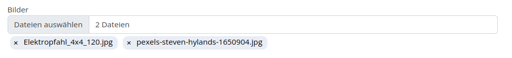

# form_extended

## What does it do?

It extends the form extension with the following features:

- Double opt-in controller + finisher for realising a registration process
- country select box by using static_info_tables
- CopyToSenderEmailFinisher: 
- Multiple file upload support
  
- Privacy policy checkbox: Set ID of policy page
- New property fields:
  - info
  - hide title
  - hide in receiver mail
  - hide in sender mail