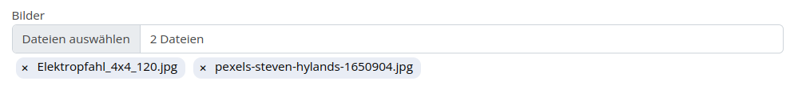

# form_extended

> [!IMPORTANT]
> ## This extension is superseded by [`wapplersystems/form`](https://github.com/WapplerSystems/form)
>
> Everything `form_extended` does now lives in **`wapplersystems/form`**, a hard fork of
> `typo3/cms-form` that ships it as part of `EXT:form` itself — without a single XCLASS.
>
> `form_extended` stays installable and keeps getting security-relevant fixes, but it
> receives **no further feature development**. New projects should use the fork; existing
> ones should migrate. Background and the full rationale:
> [#40](https://github.com/WapplerSystems/form_extended/issues/40).

---

## Why `form_extended` cannot go further

The extension is built on five XCLASSes registered in `ext_localconf.php` via
`$GLOBALS['TYPO3_CONF_VARS']['SYS']['Objects']`:

| XCLASSed core class | Needed for |
| --- | --- |
| `TYPO3\CMS\Form\Mvc\Property\TypeConverter\UploadedFileReferenceConverter` | multi-file upload |
| `TYPO3\CMS\Form\Mvc\Configuration\ConfigurationManager` | YAML load event |
| `TYPO3\CMS\Form\Controller\FormEditorController` | backend editor additions |
| `TYPO3\CMS\Backend\Form\FormDataProvider\SiteTcaInline` | senders in site configuration |
| `TYPO3\CMS\Backend\Form\FormDataProvider\SiteDatabaseEditRow` | senders in site configuration |

That single decision sets the ceiling:

* **A class can only be XCLASSed once**, and a collision is silent — the last registration
  wins with no error anywhere.
* **XCLASS is inheritance against a moving, `@internal` target.** Every core patch release can
  change a private method or a constructor signature, and the override breaks — or keeps
  working while quietly reverting a core bugfix. Maintenance means re-diffing five core
  classes forever.
* **The core is closing this door.** More classes become `final` / constructor-injected;
  `SYS/Objects` only ever worked for non-final classes created via `makeInstance()`. Each such
  change removes a hook without offering a replacement.
* **XCLASS cannot decorate DI services.** The two `FormDataProvider` overrides exist only
  because core hardcodes the inline child tables allowed in site configuration — Symfony DI
  decoration is the right tool, and it is not reachable from this design.
* **The long-standing upload issues are one bug, not nine.** #37, #36, #28, #26, #25, #24,
  #20, #17 and #14 all trace back to patching `UploadedFileReferenceConverter` from the outside
  while property mapping, multi-step navigation, FAL persistence and mail attachments live in
  classes this extension does not control.
* **The most valuable features are unreachable in principle.** The form editor is compiled
  JavaScript with no extension points. A variants/conditions UI, in-editor translations or an
  RTE e-mail content editor cannot be layered on top — the editor has to be changed.

## What the fork does instead

`wapplersystems/form` **replaces** `typo3/cms-form` through Composer:

```json
"replace": {
  "typo3/cms-form": "self.version",
  "wapplersystems/form_extended": "self.version"
}
```

* The **extension key stays `form`**, the namespace stays `TYPO3\CMS\Form\…`. Everything
  referencing `EXT:form/…`, the YAML mixins, the Fluid template paths or the FAL configuration
  keeps working unchanged.
* Packages requiring `typo3/cms-form: ^14` — or `wapplersystems/form_extended` — stay
  satisfiable, so nothing downstream has to be forked.
* **Zero XCLASSes.** The site-configuration data providers use Symfony DI `decorates:`;
  everything else is simply part of the extension.
* A parallel installation is impossible by design: with both installed, `form_extended`'s
  `FormEditorController` XCLASS displaces the fork's own and regresses the RTE and e-mail
  content editors.

Everything listed under [Features](#features) below is carried over. On top of it the fork adds:

* **Backend editor** — visual variants/conditions editor for every renderable, per-site-language
  translation in the inspector including a whole-form translation matrix, RTE e-mail content
  editor with field-marker insertion, server-rendered preview, test send and a separate
  plain-text body.
* **Cross-field (form-level) validators** — declared next to `finishers`, seeing the whole
  submission instead of one field.
* **CAPTCHA-free spam protection in four server-enforced layers** — honeypot, Shannon-entropy +
  gibberish filter, signed JavaScript challenge, minimum fill-in time. No third-party service,
  no image puzzles, no request leaving the site, nothing to declare in a cookie banner, and it
  works on fully cached pages. Measured on one production contact form over 27 days: 15,332
  logged validation failures, **98.7 % of them bot signatures**, 125 attacking sessions against
  10 genuine visitors, zero spam delivered.
* **Password-policy frontend** — live requirement indicator, reveal toggle and a
  policy-compliant generator, backed by a localized JSON endpoint.
* **Opt-in logging** — validation failures (storing no submitted values), outgoing mail log,
  consent log.
* **More PSR-14 events** — finisher pipeline, variant evaluation and rendering are pluggable
  from outside instead of by class extension.
* **A real upstream-sync workflow** for tracking core releases.

## Migration

```bash
composer remove wapplersystems/form_extended

# TYPO3 v14
composer require wapplersystems/form:^14.3
# TYPO3 v13
composer require wapplersystems/form:dev-release/v13

vendor/bin/typo3 cache:flush
```

**`cache:flush` is mandatory.** The compiled DI container and the cached form configuration
hold class references; until the caches are rebuilt the frontend fails with e.g.
`Class "…\FormExtended\Domain\Finishers\RedirectToUriFinisher" not found`.

### Site Set — mind the hyphen

The Site Set is named **`wapplersystems/form-extended`** (hyphen) while the package and
extension key are `form_extended` (underscore), so grepping for `form_extended` misses it.
A surviving stale reference invalidates the depending set, the invalidation cascades, and the
site goes down with `Site <id> depends on unavailable sets`.

Replace the dependency with `typo3/form` in every `Configuration/Sets/*/config.yaml`, and
validate against the `name:` values that actually exist rather than grepping for the package
name.

### Code touchpoints

| `form_extended` | `wapplersystems/form` |
| --- | --- |
| `WapplerSystems\FormExtended\Event\MailBeforeSendingEvent` | `TYPO3\CMS\Form\Event\MailBeforeSendingEvent` — public readonly properties (`$event->mail`, `$event->finisherContext`, `$event->finisher`), not getters |
| `WapplerSystems\FormExtended\Event\AfterYamlConfigurationLoadedEvent` | dispatched natively by the fork's `ConfigurationManager` |
| `FormExtended\Utility\Uuid::generate()` | `Symfony\Component\Uid\Uuid::v4()->toRfc4122()` — identical RFC 4122 v4 string, and `symfony/uid` is already a hard dependency of `typo3/cms-core` |
| `formevh:` ViewHelper namespace | the equivalents ship inside the fork |

### Zero-downtime order when a Site Set is involved

Add the new package while keeping the old one → `composer update` → **immediately** flip the
site config to `typo3/form` → `cache:flush` → only then remove `form_extended` →
`composer update` → `cache:flush`. Never leave a window in which the site config names a set
that does not exist.

---

## Features

> Kept for reference and for installations that have not migrated yet. All of this is
> available in `wapplersystems/form`.

It extends the form extension with the following features:

- country select box by using static_info_tables
- CopyToSenderEmailFinisher:
- Multiple file upload support
  
- Privacy policy checkbox: Set ID of policy page
- New property fields:
  - info
- Choose template for email
- Choose language for email
- Sender registration in site sets: Editors can choose valid senders in the plugin settings
- New view helpers:
  - RenderProcessedFormValueViewHelper: Render value of a single form field

## Feature: Set senders in site configuration

With the sender-in-site feature, administrators can define valid senders in the site configuration and editors can select them in the plugins.

First step: Activate the feature in the side wide options.


Second step: Configure new valid addresses


It is no longer possible to set the sender manually.


Third step: Choose sender address in plugin


